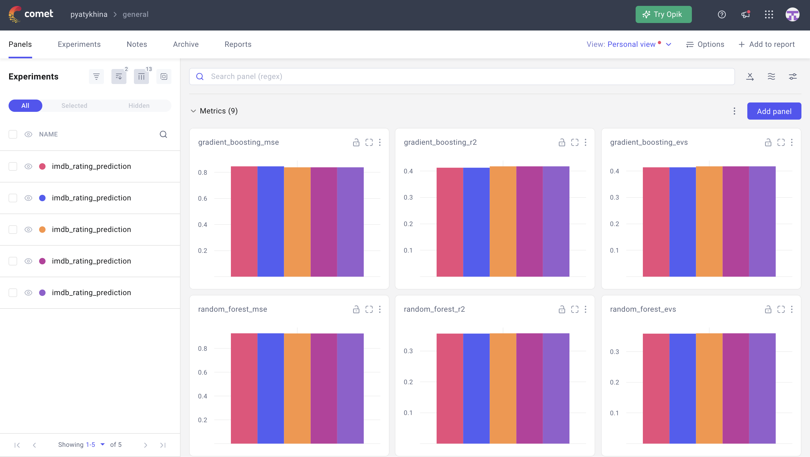

## Movie rating prediction

### Experiment tracking:
https://www.comet.com/pyatykhina/general/view/new/panels

**.env** file sample:
```
COMET_API_KEY=...
COMET_PROJECT_NAME=...
COMET_WORKSPACE=...
```



### Docker start commands:
```
docker run -it -p 9999:8888 gradient_boosting_model-api
```
```
docker-compose up --build
```
API: http://localhost:9999
